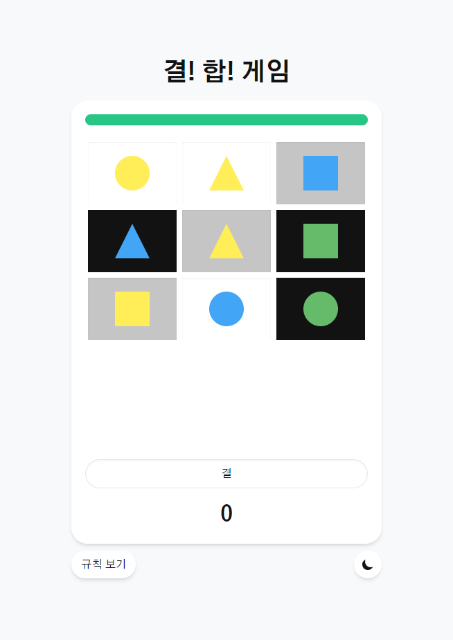

    

# 결! 합!

'결! 합!'은 9장의 그림 중 그림의 속성이 모두 같거나 모두 다른 조건 세 가지를 충족시키는 그림 3장을 찾아내는 게임입니다.

 

## 배포 주소

> https://soprue.github.io/gyeolhap/

 

## 스크린샷

| 설명      | 화면                                                    |
| --------- | ------------------------------------------------------- |
| 초기 화면 |            |
| 다크모드  |       |
| 규칙 보기 |            |
| 게임 시작 |            |
| 게임 진행 |  |
| 게임 종료 |       |

 

## 사용 기술

-   React (react-device-detect, react-hot-toast)
-   JavaScript
-   Tailwind CSS
